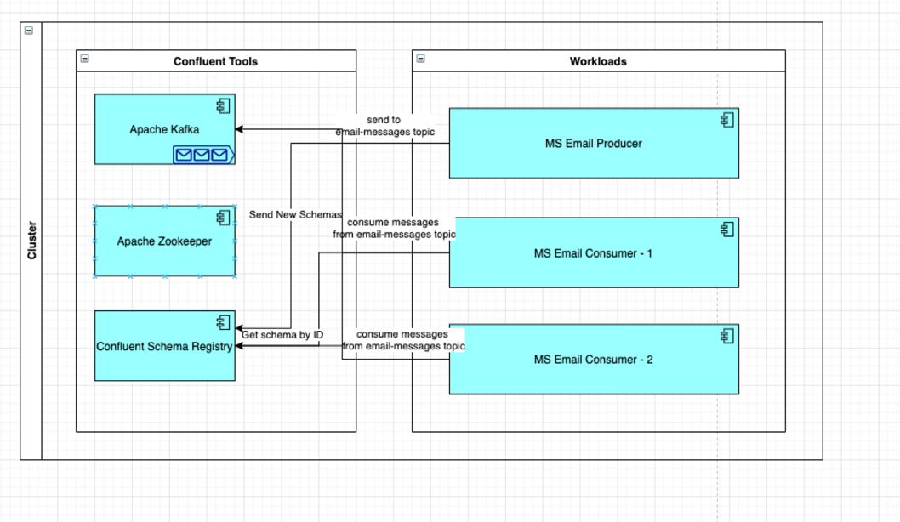
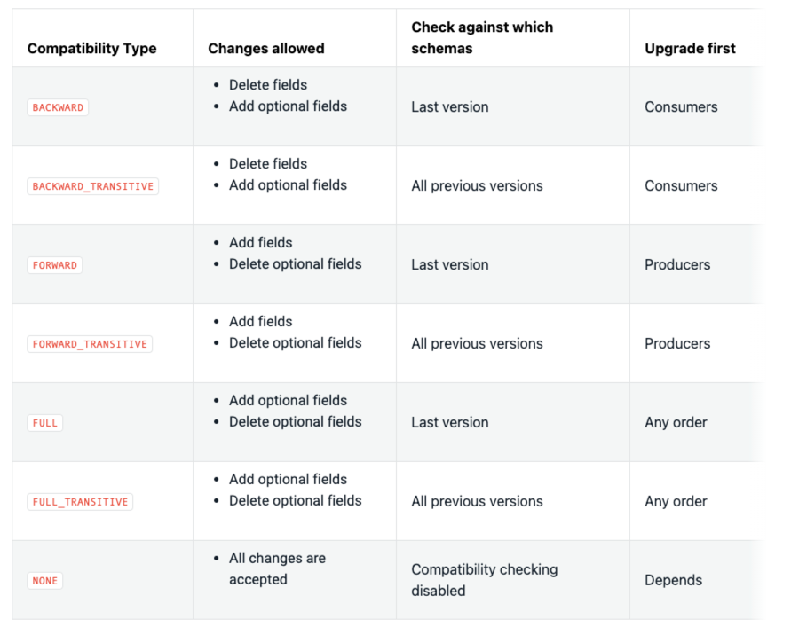

# Spring Boot And Confluent Platform

This project created demo purposes of confluent platform especially schema registry.
The project contains Apache Kafka, Zookeeper, Confluent Schema Registry, Email Producer and Email Consumer 
Applications. 

High level diagram:



Note: [Download](./assets/presentation/spring-confluent-ecosystem.pptx) Spring Boot And Confluent Platform Presentation.

## 1. Requirements

- Unix/Linux OS
- Makefile
- Docker and Docker Compose

## 2. Installation

- `make set-up` - for setting up a docker network
- `make up` - for building & starting apache kafka, apache zookeeper, confluent schema registry, email producer, 
  email consumer (with 2 replication) apps
- `make ms-email-consumer-logs ` - all consumers logs will be printed 
- `make send-email-message ` - it will send request to email producer 
- `make down` - for shutdown apache kafka, apache zookeeper, confluent schema registry, email producer,
  email consumer apps
- `make clean` - for removing the docker network

Ps: Each app also is runnable individually by `make ms-email-consumer-up` or `make ms-email-producer-down`.

## 3. Accessibility & Configuration

- **Email Producer APP** will be available at `http://localhost:8080`
- **Zookeeper** will be available at `http://localhost:2181`
- **Kafka** will be available at `http://localhost:9092`
- **Schema Registry** will be available at `http://localhost:8081`

Schema Registry Compatibility Types:



Note: The Confluent Schema Registry default compatibility type is BACKWARD.

## 4. Message Formats Benchmark

Used Data:
```json
{
  "to": [
    "me@shahinnazarov.com"
  ],
  "cc": [],
  "bcc": [],
  "content": "Demo",
  "mimeMessage": false,
  "attachments": {},
  "from": "no-reply@shahinnazarov.com"
}
```
Benchmark for size/serialization and deserialization:

| Message Format | Size (bytes) | Serialization Time (milliseconds) | Deserialization Time (milliseconds) |
| -------------- | ------------ | --------------------------------- | ----------------------------------- |
| protobuffer | 56 | 4 | 0 |
| apache avro | 56 | 3 | 2 |
| json | 138 | 7 | 4 |

## 5. Credits

[Spring Boot Kafka Docs](https://spring.io/projects/spring-kafka)
[Schema Registry Docs](https://docs.confluent.io/platform/current/schema-registry/index.html)
[Apache Avro](https://avro.apache.org/docs/1.10.2/)
[Proto Buffers](https://developers.google.com/protocol-buffers/docs/overview)
[Schemas, Contracts, and Compatibility](https://www.confluent.io/blog/schemas-contracts-compatibility/)
[17 Ways to Mess Up Self-Managed Schema Registry](https://www.confluent.io/blog/17-ways-to-mess-up-self-managed-schema-registry/)
[Kafka Avro Schema Registry Example](https://www.baeldung.com/spring-cloud-stream-kafka-avro-confluent)

